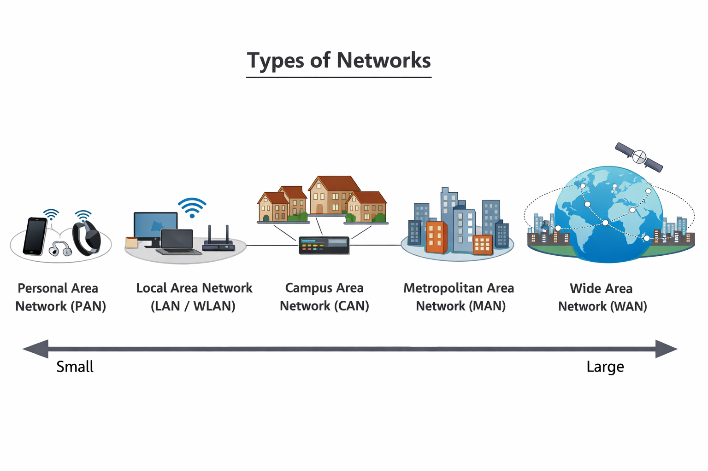
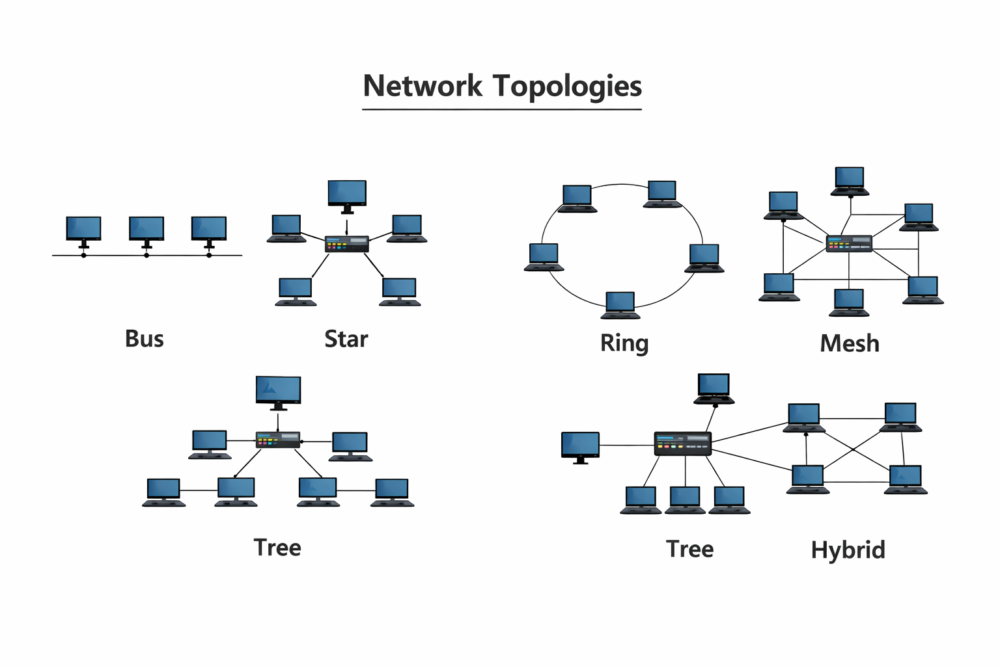
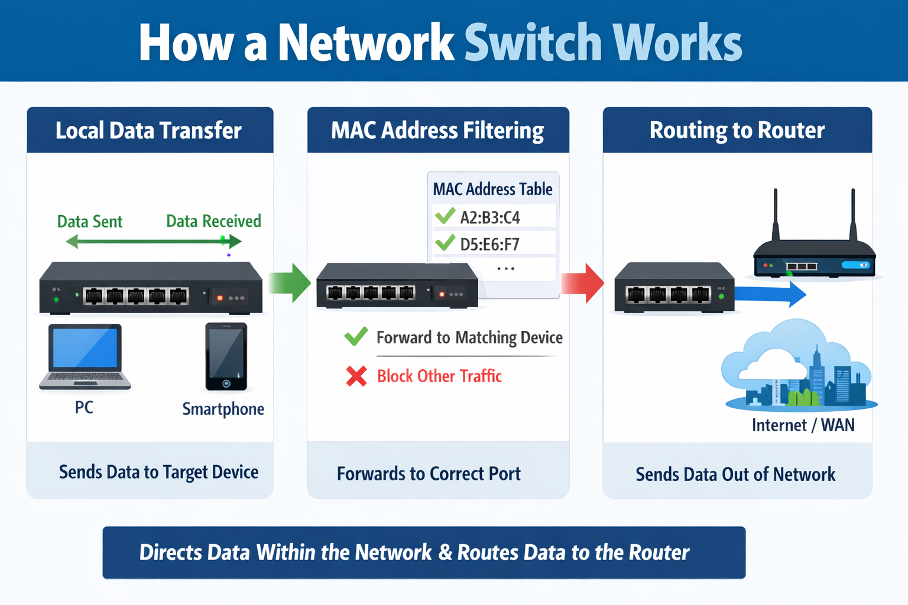

# Networking Fundamentals

An introductory overview of fundamental networking concepts, explaining how data is transmitted, addressed, and routed within computer networks.

## What is a Network?
Networks are connections between entities, found in many aspects of life, e.g., friend circles or family relationships.

In computing, however, a network is the connection of technological devices that allows them to share and exchange information, data and resources.

## Types of Networks

Computer networks are categorized based on their size, scope, and intended use, and each type supports communication and resource sharing in various environments.

**1. Personal Area Network `PAN`:** A small network for connecting devices around a single person, typically within a few meters.
> Example: Connecting a smartphone to a Bluetooth headset.

**2. Local Area Network `LAN`:** A network covering a small area like a home, office, or building, allowing devices to share resources.
  - A Wireless Local Area Network `WLAN` is a type of LAN that uses wireless connections (Wi-Fi) instead of cables.
> Example: Computers in an office connected to the same router `LAN` or accessing the office Wi-Fi `WLAN`.

**3. Campus Area Network `CAN`:** A network that connects multiple LANs within a limited area like a university or corporate campus.
> Example: Network connecting all departments in a university campus.

**4. Metropolitan Area Network `MAN`:** A network that spans a city or town, connecting multiple LANs.
> Example: Network linking branch offices of a city-based bank.

**5. Wide Area Network `WAN`:** A large network that spans cities, countries, or even globally, often using leased telecommunication lines.
> Example: The internet connecting users worldwide.

## Types of Network Topologies

Network topology refers to the physical or logical arrangement of devices (nodes) and connections (links) in a network. The common types include:

**1. Bus Topology:** All devices share a single communication line.
> Example: Old Ethernet networks using a coaxial cable.

**2. Star Topology:** All devices connect to a central hub or switch.
> Example: Modern office `LANs` with a central switch.

**3. Ring Topology:** Devices are connected in a circular manner, data travels in one or both directions.
> Example: Token Ring networks in some legacy systems.

**4. Mesh Topology:** Every device is connected to every other device.
> Example: Some WAN backbone networks for reliability.

**5. Tree Topology:** Hierarchical arrangement of star networks connected together.
> Example: University networks connecting departments and buildings.

**6. Hybrid Topology:** Combination of two or more topologies.
> Example: Large corporate networks combining star and mesh layouts.

## Network Models

A network model is a layered framework that explains how data is transmitted and communicated between devices on a network.

Network models describe how network communication is structured and standardized using layered architectures. The two primary network models are:

**1. Open System Interconnection `OSI` Model:** A conceptual seven-layer model used to understand, design, and troubleshoot network communication. An overview of each `OSI` Layer:
  - **Layer 1 `Physical`:** Transmits raw bits over physical media.
    > Example: Network cables and electrical signals.

[Click here for more...](./osi-layer-1.md)
    
  - **Layer 2 `Data Link`:** Manages physical addressing and error detection.
    > Example: Ethernet frames using MAC addresses.

[Click here for more...](./osi-layer-2.md)
    
  - **Layer 3 `Network`:** Handles logical addressing and routing.
    > Example: `IP` routing packets across networks.
    
[Click here for more...](./osi-layer-3.md)

  - **Layer 4 `Transport`:** Ensures reliable or fast data delivery.
    > Example: `TCP` for reliable transmission, `UDP` for fast streaming.
    
[Click here for more...](./osi-layer-4.md)

  - **Layer 5 `Session`:** Manages sessions and connections between devices.
    > Example: Maintaining a login session.
    
  - **Layer 6 `Presentation`:** Handles data formatting, encryption, and compression.
    > Example: `SSL/TLS` encrypting data.
    
  - **Layer 7 `Application`:** Provides network services directly to user applications.
    > Example: Web browsers using `HTTP`.

**2. Transmission Control Protocol / Internet Protocol `TCP/IP` Model:** A practical four-layer model used in real-world networks, especially the Internet. Each `TCP/IP` layers are listed below:
  - **Network Access Layer:** Manages physical transmission and local network delivery.
    > Example: Ethernet and Wi-Fi.
    
  - **Internet Layer:** Handles logical addressing and routing across networks.
    > Example: `IP` and `ICMP`.
    
  - **Transport Layer:** Manages end-to-end communication and reliability.
    > Example: `TCP` and `UDP`.
    
  - **Application Layer:** Combines `OSI` application, presentation, and session layers; provides network services to applications.
    > Example: `HTTP`, `FTP`, `SMTP`.

## Network Communication

Network communication is the process by which devices exchange data using defined rules and mechanisms.

### Components of Network Communication

**1. Endpoints (Nodes):** Computers, phones, printers, servers that send or receive data.

**2. Networking Devices:** Equipment that forwards, filters, or manages data.
   - **Switch:**  Connects devices within a local network `LAN` and forwards data based on Media Access COntrol `MAC` addresses.
     > Example: Connecting multiple computers in an office network.

   - **Router:** Connects different networks and routes data based on IP addresses.
     > Example: Routing traffic between a home network and the Internet.

   - **Access Point:** Provides wireless access to a wired network.
     > Example: Allowing laptops and phones to connect to a `LAN` via Wi-Fi.

   - **Modem:** Converts signals between a digital network and an ISP’s transmission medium.
     > Example: Converting `ISP` signals to usable Internet access at home.

   - **Firewall:** Monitors and controls incoming and outgoing network traffic based on security rules.
     > Example: Blocking unauthorized access to a corporate network.

**3. Transmission Media:** These are the paths thorugh which data travels from a sender to a reciever. It is classified into two main types:
  - Guided Media (Wired): Data travels through a  physical medium.
    > Examples: Ethernet and Fiber-optic cables

  - Unguided Media (Wireless): Data travels through air as electromagnetic waves.
    > Examples: Radio waves, Microwaves and Infrared

  > While wireless media are more flexible and mobile than wired media, they are more susceptible to interference and eavesdropping.

**4. Protocols:** These are rules governing communication ensuring devices speak the same language. There are classified based on based on fucntion and layer, below are the classes of protocols based on their layers:

  **a. Application Layer Protocols:** Enables communication between applications and users.
    - HyperText Transfer Protocol and Secure `HTTP / HTTPS`: Communication between web browsers and websites.
    - File Transfer Protocol `FTP`: Transferring computer files between a client and a server on a network.
    - Simple Mail Transfer Protocol / Post Office Protocol 3 / Internet Message Access Protocol `SMTP / POP3 / IMAP`: Email Transmission.

  **b. Transport Layer Protocols:** Controls data delivery between hosts.
    - Transmission Control Protocol `TCP`: Reliable, ordered, error-checked delivery.
    - User Datagram Protocol `UDP`: Fast, connectionless delivery.
    
  **c. Internet / Network Layer Protocols:** Handles addressing and routing.
    - Internet Protocol `IP`: Logical addressing and packet routing
    - Internet Control Message Protocol `ICMP`: Error reporting and diagnostics

**5. Addressing:** Addressing identifies devices and services on a network so data reaches the correct destination. It is classified below:

  a. Physical Addressing:
    - MAC Address: Unique hardware identifier at Layer 2
      > Example: Used by switches for local delivery
  b. Logical Addressing:
    - IP Address (IPv4 / IPv6): Identifies devices across networks
      > Example: Used by routers for packet routing
  c. Port Addressing: 
    -Port Numbers: Identify specific services on a device
      > Example: HTTP (80), HTTPS (443)

**6. Performance Metrics:** Performance metrics are measurable values used to evaluate the efficiency, reliability, and quality of network communication. They are critical for assessing normal behavior and identifying anomalies. They include:
   | **Metric** | **Common Units** |
   |:----:|:----:|
   | **Bandwdith** | bits per second `bps`, and multiples `Kbps, Mbps, Gbps` |
   | **Throughput** | bits per second `bps`, and multiples `Kbps, Mbps, Gbps` |
   | **Goodput** | bits per second `bps`, and multiples `Kbps, Mbps, Gbps` |
   | **Latency** | milliseconds `ms`. |
   | **Jitter** | milliseconds `ms`. |
   | **Packet Loss** | Percentage `%` or a fraction. |
   
   [Click here for their descriptions.](#key-concepts-of-data-transmission)

   
## Data Transmisson
Data transmission refers to the process of sending data from one device to another over a communication medium, following defined rules (protocols) to ensure accurate and reliable delivery.

### Classification of Data Transmission

Here are some classifications of Data Transmission:

**1. Based on Direction of Data Flow:**
  - **Simplex:** Data flows in one directino only.
    > Example: Keyboard to computer.

  - **Half-Duplex:** Data flows in both directions, but not at the same time.
    > Example: Walkie-talkies.

  - **Full-Duplex:** Data flows in both directions simultaneously.
    > Example: Modern Ethernet communication.

**2. Based on Signal Type:**
  - **Analog Transmission:** Uses continuous signals.
    > Example: Traditional telephone calls.

  - **Digital Transmissionn:** Uses discreate binary signals.
    > Example: Computer network data.

**3. Based on Data Delivery Method**
  - **Unicast:** One sender to one receiver.
    > Example: A user accessing a website.

  - **Broadcast:** One sender to all devices on a network.
    > Example: `ARP` requests in a `LAN`.

  - **Multicast:** One sender to a selected group of receivers.
    > Example: Internet Protocol Television `IPTV` streaming.

### Key concepts of Data Transmission

Data transmission is built on the following key concepts:

**1. Source and Destination:** The originating device and the intended receiving device of the data.suspicious traffic.

**2. Transmission Medium:** The path through which data travels (wired or wireless).

**3. Data Encoding:** The conversion of data into signals suitable for transmission.

**4. Bandwidth:** The maximum theoretical data capacity of a network link.

**5. Transmission Modes:** The direction and timing of data flow (simplex, half-duplex, full-duplex).

**6. Error Detection and Correction:** Mechanisms used to identify and fix transmission errors.

**7. Protocols:** Rules that govern how data is transmitted, received, and acknowledged.

**8. Latency:** The time delay in data transfer from source to destination.

**9. Throughput:** The actual rate of successful data delivery over time, accounting for overhead and network conditions.

**10. Goodput:** A subset of throughput that measures only the useful data delivered to the destination.

**11. Jitter:** The variation in packet delay over time, critical for maintaining quality in real-time applications like video or VoIP.

**12 .Packet Loss:** The percentage of data packets that fail to reach their destination, often requiring retransmissions.

<!--- _Difference between Packet and Circuit Switching [here]_ --->
### Network Switching

Network Switching is the process of directing data from one device to another within a network or between networks, using switches.
  > A switch connects devices within a network, sending data only to the intended recipient using `MAC` addresses. It delivers information to devices like computers and phones and forwards data to a router for communication outside the local network.

### Network Switching Process
**Frame Arrival:** A device sends a data frame to the switch.

**Learning:** The switch reads the source `MAC` address and notes which port it came from, adding this pair to its `MAC` table.

**Lookup:** The switch reads the destination `MAC` address in the frame.

**Forwarding:** If `MAC` is known, the switch forwards the frame only out the port associated with the destination `MAC` address (direct communication). If `MAC` is unknown, the switch "floods" the frame out all ports (except the one it came in on) to find the device.

### Types of Network Switching
There are three types of Network switching:

  - **Circuit Switching:** A dedicated communication path is established between sender and receiver for the entire session.
    > Example: Traditional telephone networks.
    
  - **Packet Switching:** Data is broken into packets that travel independently across the network and are reassembled at the destination.
    > Example: The Internet.

  - **Message Switching:** Data is sent as a complete message to the network, stored temporarily at intermediate nodes, and then forwarded to the next node until it reaches the destination. Also know as store-and-forward switching.

    > Example: Email systems and early telegraph networks.

### Comparision of Network Switching Types

| **Feature** | **Circuit Switching** | **Packet Switching** | Message Switching |
|:---:|:---|:---|:---|
| **Connection** | A fixed, dedicated path is established before transmission. | No dedicated path; packets sent independently | No dedicated path; messages sent as a whole and stored at nodes |
| **Resource Usage** | Reserved for whole session, even when idle | Used only when sending packets | Intermediate nodes store message until forwarded |
| **Delay** | Low delay after initial setup. | Delay varies based on network conditions. | High transmission delay. |
| **Reliability** | Reliable with guaranteed connection. | Reliable with error control and retransmission. | Less reliable and obsolete. |
| **Efficiency** | Inefficient because bandwidth remains reserved even when idle. | Highly efficient due to optimal bandwidth utilization. | Very inefficient due to full message storage and forwarding. |
| **Data Transfer** | Continuous stream | Discrete packets | Complete messages |

